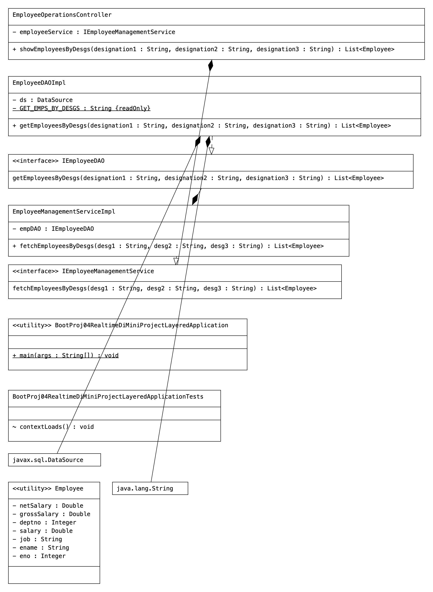

# Code

```Java
package com.employee;

import java.util.Arrays;
import java.util.List;

import org.springframework.boot.SpringApplication;
import org.springframework.boot.autoconfigure.SpringBootApplication;
import org.springframework.context.ApplicationContext;
import org.springframework.context.ConfigurableApplicationContext;

import com.employee.controller.EmployeeOperationsController;
import com.employee.model.Employee;

@SpringBootApplication
public class BootProj04RealtimeDiMiniProjectLayeredApplication {

    public static void main(String[] args) {
        // get IOC container
        ApplicationContext ctx = SpringApplication.run(BootProj04RealtimeDiMiniProjectLayeredApplication.class, args);
        // get access to controller class obj
        EmployeeOperationsController controller = ctx.getBean("empController", EmployeeOperationsController.class);
        // invoke the b.method
        try {
            List<Employee> list = controller.showEmployeesByDesgs("CLERK", "MANAGER", "SALESMAN");
            list.forEach(emp -> {
                System.out.println(emp);
            });
        } catch (Exception e) {
            e.printStackTrace();
            System.out.println("PRoblem is code ::" + e.getMessage());
        }

        System.out.println("+++++++++++++++++++++++++++++++++++++++++++++++++++++++");

        String beanids[] = ctx.getBeanDefinitionNames();
        System.out.println("All bean ids are ::" + Arrays.toString(beanids));

        // close the IOC container
        ((ConfigurableApplicationContext) ctx).close();

    }

}
package com.employee.controller;

import java.util.List;

import org.springframework.beans.factory.annotation.Autowired;
import org.springframework.stereotype.Controller;

import com.employee.model.Employee;
import com.employee.service.IEmployeeManagementService;

@Controller("empController")
public class EmployeeOperationsController {
    @Autowired
    private IEmployeeManagementService employeeService;

    public List<Employee> showEmployeesByDesgs(String designation1, String designation2, String designation3)
            throws Exception {
        // use service
        List<Employee> list = employeeService.fetchEmployeesByDesgs(designation1, designation2, designation3);
        return list;
    }

}
package com.employee.dao;

import java.util.List;

import com.employee.model.Employee;

public interface IEmployeeDAO {
    public List<Employee> getEmployeesByDesgs(String designation1, String designation2, String designation3) throws Exception;
}
package com.employee.dao;

import java.sql.Connection;
import java.sql.PreparedStatement;
import java.sql.ResultSet;
import java.sql.SQLException;
import java.util.ArrayList;
import java.util.List;

import javax.sql.DataSource;

import org.springframework.beans.factory.annotation.Autowired;
import org.springframework.stereotype.Repository;

import com.employee.model.Employee;

@Repository("empDAO")
public class EmployeeDAOImpl implements IEmployeeDAO {
    private static final String GET_EMPS_BY_DESGS = "SELECT EMPNO,ENAME,JOB,SAL,DEPTNO FROM EMP WHERE JOB IN(?,?,?) ORDER BY JOB ";
    @Autowired
    private DataSource ds;

    @Override
    public List<Employee> getEmployeesByDesgs(String designation1, String designation2, String designation3) throws Exception {
        System.out.println("EmployeeDAOImpl.getEmployeesByDesgs()::  DataSource obj class name::" + ds.getClass());
        List<Employee> list = null;
        try (// get pooled connectoon from the DataSource
             Connection con = ds.getConnection();
             // create PreparedStatemetn object using the con obj
             PreparedStatement ps = con.prepareStatement(GET_EMPS_BY_DESGS);) { // try with resource
            // set method args as the query param values
            ps.setString(1, designation1);
            ps.setString(2, designation2);
            ps.setString(3, designation3);
            try (// execute the SQL Query
                 ResultSet rs = ps.executeQuery();) { // nested try with resource
                // initialize the ArrayList
                list = new ArrayList();
                // process the ResultSet to copy its recods List<Employee> obj as the Employee
                // objs
                while (rs.next()) {
                    // copy each record to Employee class obj
                    Employee emp = new Employee();
                    emp.setEno(rs.getInt(1));
                    emp.setEname(rs.getString(2));
                    emp.setJob(rs.getString(3));
                    emp.setSalary(rs.getDouble(4));
                    emp.setDeptno(rs.getInt(5));
                    // add Employee class obj to List Colelction
                    list.add(emp);
                } // while
            } // try2
        } // try
        catch (SQLException se) { // for handling known exeception
            se.printStackTrace();
            throw se; // Exeption rethrowing for Exception Propagration
        } catch (Exception e) { // for handling unknown exception
            e.printStackTrace();
            throw e;
        }
        return list;
    }// method

}// class
package com.employee.model;

import lombok.Data;

@Data
public class Employee {
    // bean properties
    private Integer eno;
    private String ename;
    private String job;
    private Double salary;
    private Integer deptno;
    private Double grossSalary;
    private Double netSalary;

}
package com.employee.service;

import java.util.List;

import org.springframework.beans.factory.annotation.Autowired;
import org.springframework.stereotype.Service;

import com.employee.dao.IEmployeeDAO;
import com.employee.model.Employee;

@Service("empService")
public class EmployeeManagementServiceImpl implements IEmployeeManagementService {
    @Autowired
    private IEmployeeDAO empDAO;

    @Override
    public List<Employee> fetchEmployeesByDesgs(String desg1, String desg2, String desg3) throws Exception {
        // use DAO
        List<Employee> list = empDAO.getEmployeesByDesgs(desg1, desg2, desg3);
        list.forEach(emp -> {
            // b.logic to calculate the grossSalary and netSalary
            emp.setGrossSalary(emp.getSalary() + (emp.getSalary() * 0.4));
            emp.setNetSalary(emp.getGrossSalary() - (emp.getGrossSalary() * 0.2));
        });

        return list;
    }

}
package com.employee.service;

import java.util.List;

import com.employee.model.Employee;

public interface IEmployeeManagementService {
    public List<Employee> fetchEmployeesByDesgs(String desg1, String desg2, String desg3) throws Exception;
}
```

# UML

